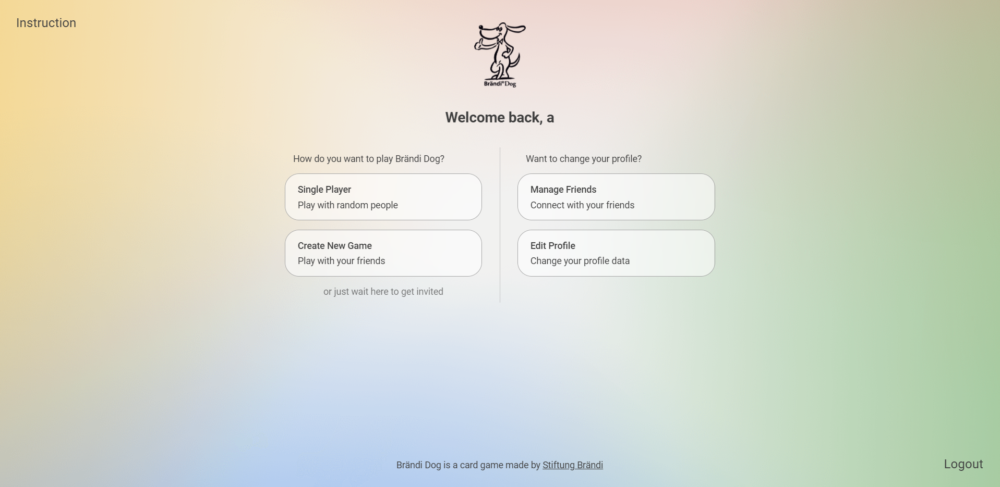

<h1 align="center">
   
   
   
  Remy's Best Client
   
</h1>

  

## Introduction

Brändi Dog is a fun card/board game created by [Stiftung Brändi](https://www.braendi.ch/). This repository is the frontend part of an online implementation for this board game.

[Read the complete game instruction](https://www.connexxion24.com/downloads/anleitungen-braendi-dog/Spielregeln-braendi-dog-englisch.pdf)

## Technologies

The client is written in JavaScript using React. For styling, Scss is used.

To establish a connection between the frontend and the backend REST and Websockets are used.

## High-level Components

The [Home](src/views/auth/Home.js) view represents the first entry point for a user after having succesfully logged in. This view is the central navigation point. One can either navigate to the single player mode or create a new game to search for players or do administrative tasks like managing friends or updating the user's profile. Furthermore, a websocket connection will be established from here. The client is subscripted to two private topics. One for receiving game invitations and one for receiving a countdown that showcases the remaining time the request is pending.

The [Waiting Room](src/views/auth/WaitingRoom.js) view is our central entity to enable users to play in a single player fashion without the need of knowing friends who want to play. The waiting room, which gets treated as a global queue, collects users until the amount of 4 users is reached, which is enough to start a game. At this point a new game will be started automatically with the first 4 users in the waiting room queue. On this view, two important websocket subscriptions are being established. One to receive the current user list everytime a user enters or leaves the waiting room. A second one to receive the gameId to get redirected to the correct game views after getting assigned to a game. The game assignment can either if the user is under the first 4 in the waiting room or when the user got fetched by a game host who decided to fill-up his game with people from the waiting room.

The [Create New Game](src/views/auth/CreateNewGame.js) view acts as a alternative to the waiting room which a user can host a new game and invite its friends. A friend which has accepted a game invitation can then invite its friends and so on. This view receives a currently invited user list and a already accepted user list via two separated websocket subscriptions. The countdown for the invited user to accept a game invitation is set to 15 seconds and is also sent from the backend through a distinct websocket subscription.

The [Game](src/views/auth/Game.js) view manages all in-game packages (hands, board, move-requests, marble-requests etc). It recieves the game state and renders the view accordingly. 

The Websocket Context is based on [React's Context](https://reactjs.org/docs/context.html) and consists of the [Websocket Provider](src/components/context/WebsocketProvider.js) and [Websocket Consumer](src/components/context/WebsocketConsumer.js). The Websocket Provider manages the websocket session, holds the currently subscribed channels and represents a parent for all components which are based on a websocket connection. It is automatically getting mounted if a user enters and unmounted if the users leaves the authentication section. On the other hand, the Websocket Consumer manages the subscription to specific websocket channels and represents a wrapper for all components which listen to websocket messages.

## Launch & Development

* `npm run dev`

  Runs the app in the development mode. 
  Open [http://localhost:3000](http://localhost:3000) to view it in the browser.

  The page will reload if you make edits. 
  You will also see any lint errors in the console.

* `npm run build`

  Builds the app for production to the `build` folder. 
  It correctly bundles React in production mode and optimizes the build for the best performance.

  The build is minified and the filenames include the hashes. 
  Your app is ready to be deployed!

  See the section about [deployment](https://facebook.github.io/create-react-app/docs/deployment) for more information.

## Screenshots

Upon succesful login, the home screen appears where one can choose either to play in a singleplayer mode, create a game, manage friend or edit its profile.

When entering the waiting room, the user needs to wait until either 4 player joined the waitingroom such that the server intializes a new game or until the users gets fetched by a host in a gamesession as fill-up. 

When creating a game, the user operates as host and need to either invite people from its friendslist or fill-up the game session with users from the waiting room.

Once a game has been initialized all the players need to decide which color they want to play.

The following view is the game view. Everything from the card handout, the card exchange, performing a move and playing a card as well as eventually either winning or losing the game happens in here.

## Roadmap – the next steps

- 30 seconds of time per turn, see [#76](https://github.com/sopra-fs21-group-06/remys-best-client/issues/76)
- Password reset, see [#47](https://github.com/sopra-fs21-group-06/remys-best-client/issues/47) and [#46](https://github.com/sopra-fs21-group-06/remys-best-client/issues/46)
- Edit Avatar Image, see [#33](https://github.com/sopra-fs21-group-06/remys-best-client/issues/33) and [#32](https://github.com/sopra-fs21-group-06/remys-best-client/issues/32)

## Authors and Acknowledgements

### Members of the SoPra-Group 06 2021, also known as Remy's Best:

- [Andrina Vincenz](https://github.com/AndrinaVincenz)
- [Edouard Schmitz](https://github.com/edischmitz)
- [Pascal Emmenegger](https://github.com/pemmenegger)
- [Siddhant Sahu](https://github.com/iamsiddhantsahu)
- [Sandro Volontè](https://github.com/SandroVolonte)

### Acknowledgements

First of all we want to thank Stiftung Brändi for creating such an amazing game. We all had a fun time implementing the game, and also learned a lot.
Further we would like to thank our tutor Remy Egloff, who always provided useful advice to get cleaner code and more user-friendliness. We are also very grateful for our friends and families for testing our game extensively and also providing improvements in terms of user-friendlyness.

### License

MIT License

Copyright (c) 2021

Permission is hereby granted, free of charge, to any person obtaining a copy
of this software and associated documentation files (the "Software"), to deal
in the Software without restriction, including without limitation the rights
to use, copy, modify, merge, publish, distribute, sublicense, and/or sell
copies of the Software, and to permit persons to whom the Software is
furnished to do so, subject to the following conditions:

The above copyright notice and this permission notice shall be included in all
copies or substantial portions of the Software.

THE SOFTWARE IS PROVIDED "AS IS", WITHOUT WARRANTY OF ANY KIND, EXPRESS OR
IMPLIED, INCLUDING BUT NOT LIMITED TO THE WARRANTIES OF MERCHANTABILITY,
FITNESS FOR A PARTICULAR PURPOSE AND NONINFRINGEMENT. IN NO EVENT SHALL THE
AUTHORS OR COPYRIGHT HOLDERS BE LIABLE FOR ANY CLAIM, DAMAGES OR OTHER
LIABILITY, WHETHER IN AN ACTION OF CONTRACT, TORT OR OTHERWISE, ARISING FROM,
OUT OF OR IN CONNECTION WITH THE SOFTWARE OR THE USE OR OTHER DEALINGS IN THE
SOFTWARE.